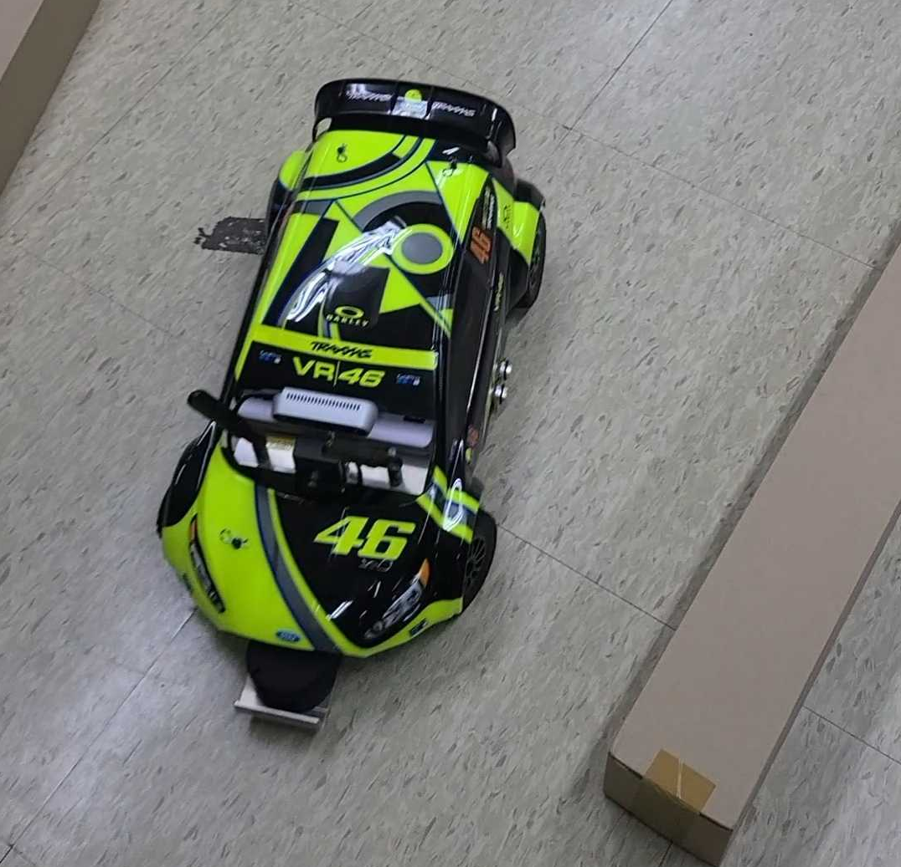

# Programmers Line Detection Project

## 목표

> **5일**간의 프로젝트 기간 내에
**실내 환경**에서
**카메라**를 이용해 차선을 검출하고
적절한 제어를 통해
**차선 유지**하며 **빠르게** 주행
> 

---

## 장비

**Xycar-D**

- Processor: NVIDIA Jetson TX2
- OS: Ubuntu
- 센서: USB 카메라, 2D 라이다, 초음파 센서, IMU 센서.

USB 카메라 센서를 이용해 프로젝트 진행.

Wi-Fi access point로 동작.

ssh 연결을 통해 파일 관리.

VESC를 이용해 구동모터, 조향모터를 제어.

ROS에서 센서 데이터 및 제어 데이터 송수신.

### **1080P USB 카메라 스펙**

170도 어안렌즈

CMOS OV2710 Sensor

120 fps (640x480), 30 fps (1920x1080)

---

## 주행환경

 

직선 구간, 곡선 구간이 혼합되어 있었으며, 차선은 검은색

코너 외곽에는 장애물 1개 내부에는 2개가 설치되어 있으며, 장애물을 건드리면 최종 랩타임에 개수에 따라 감점요소 발생

---

## 실행 및 알고리즘
- **실행**   
    - roslaunch <package_name> final.launch
- **Algorithm**
    
    
    

## 결과

### Trial 1

- **Lap time : 00:55:740**
- **Lane departure : 0 time**
- **Number of broken blocks :  3 pieces**
- **Total : 01:10.740**

### Trial 2

- **Lap time :  01:00.000**
- **Lane departure : 1 time**
- **Number of broken blocks : 2 pieces**
- **Total: 01:15.000**

---
## 프로젝트 보고서
- **[노션 바로가기](https://funny-biplane-427.notion.site/A2-9f35d98eced94403a1d1721fb89fb6c8)**

